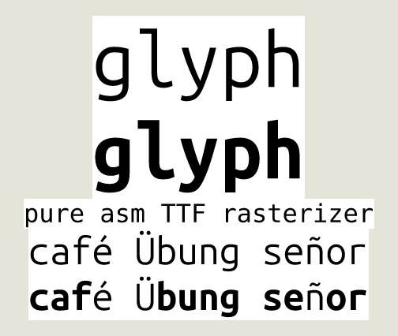

# glyph - Pure Assembly TTF Rasterizer



      

TrueType font rasterizer written in x86_64 Linux assembly. No libc, no
runtime, no FreeType, no harfbuzz. Pure syscalls. Single static binary,
~37KB.

Parses TTF tables, flattens quadratic Béziers, scanline-rasterises with
non-zero winding fill, 4×4 box-filter antialiasing, emits PGM (P5) on
stdout. Handles composite glyphs, UTF-8 input, and OpenType variable
fonts (fvar + gvar + IUP) — so glyph renders your real kitty font at
any weight from 100 (Thin) to 700 (Bold), interpolated correctly.

Part of the **[CHasm](https://github.com/isene/chasm)** (CHange to ASM) suite:
[bare](https://github.com/isene/bare) (shell),
[glass](https://github.com/isene/glass) (terminal),
[show](https://github.com/isene/show) (file viewer),
[tile](https://github.com/isene/tile) (window manager),
glyph (font rasterizer).

<br clear="left"/>



glyph rendering its own name at 96px regular and bold (variable-font
weight axis interpolated via gvar deltas + IUP), then a strapline
in DejaVu Sans Mono, then accented Latin in regular and bold to show
composite-glyph + UTF-8 + variable-weight all working together.

## Install

### From source (requires nasm and ld)

```bash
git clone https://github.com/isene/glyph.git
cd glyph
make
```

The build is two commands; nothing to install (no system path needed).
Drop the resulting `glyph` binary anywhere on `$PATH` if you want it
globally available.

## Usage

```bash
# Single codepoint (legacy CLI, kept for back-compat)
glyph FONT.ttf CODEPOINT SIZE [WEIGHT] > out.pgm

# Multi-character UTF-8 string with proper baseline + advance widths
glyph FONT.ttf 'STRING' SIZE [WEIGHT] > out.pgm

# Examples
glyph DejaVuSansMono.ttf 65 32        > A.pgm     # 'A' at 32px
glyph DejaVuSansMono.ttf 'Hello!' 32  > hello.pgm # full string
glyph 'UbuntuSansMono[wght].ttf' 'Hello' 48 700 > bold.pgm  # variable-font Bold

# View
feh out.pgm                    # or
xdg-open out.pgm               # or convert to PNG:
convert out.pgm out.png
```

The optional `WEIGHT` argument is only meaningful for variable fonts
(those with an `fvar` table and a `wght` axis). For static fonts it is
silently ignored. Default = the axis's declared default value (usually
400 = Regular).

Codepoint mode dispatches when the second argument starts with a digit;
otherwise it's treated as a UTF-8 string.

## How It Works

glyph is a single `.asm` file that does all the steps a font engine
needs and nothing else:

1. **Parse** — `mmap` the font file. Walk the SFNT table directory to
   locate `head`, `maxp`, `hhea`, `hmtx`, `cmap`, `loca`, `glyf` (plus
   `fvar`, `gvar`, `avar` for variable fonts). All offsets cached at
   startup.
2. **Look up** — `cmap` format-4 segment search resolves a Unicode
   codepoint to a glyph ID. UTF-8 input is decoded inline (1- to
   4-byte sequences).
3. **Outline** — `loca` gives the byte range for that glyph in `glyf`.
   For simple glyphs, parse contours, end-points, packed flags (with
   REPEAT) and packed delta-encoded coordinates. For composite glyphs,
   walk components and recurse with each component's xy translation.
4. **Variable fonts** — if `gvar` is present and the user asked for a
   non-default weight, decode the per-glyph tuple-variation data:
   shared/private packed point lists, packed delta runs (zero, byte,
   word), per-axis tuple scalars (default region or explicit
   intermediate). Run **IUP (Interpolation of Untouched Points)** per
   axis per contour to fill in deltas for points the font didn't list
   explicitly. Apply scalar × delta to every coordinate.
5. **Layout** — for string mode, advance widths come from `hmtx`
   (with the monospace tail handled). Each glyph is positioned at its
   pen offset; image height = (ascent − descent) × scale so descenders
   in g/y/p/q drop below the baseline naturally.
6. **Flatten** — quadratic Béziers (the only kind in TTF) are
   subdivided into 8 line segments each. Implicit on-curve points are
   inserted between consecutive off-curves per the TTF convention.
7. **Rasterise** — every line segment becomes an active edge. Per
   scanline, sort intersections by x and fill spans where the
   non-zero winding sum is non-zero. The supersample buffer is 4× the
   target resolution in each dimension.
8. **Antialias** — 4×4 box filter from the supersample buffer to the
   output greyscale buffer (16 samples per output pixel).
9. **Emit** — write a PGM (P5) header and raw alpha bytes to stdout.

## Features

### Font parsing
- TTF / OpenType (TrueType outline) via the SFNT directory
- Required tables: head, maxp, hhea, hmtx, cmap (fmt 4), loca, glyf
- Optional: fvar, gvar, avar
- Big-endian readers (be_u16 / be_i16 / be_u32) handled inline
- Long and short loca formats
- Both monospace tail in hmtx (numberOfHMetrics < numGlyphs) and the
  per-glyph longHorMetric layout

### Glyph types
- **Simple glyphs**: full delta-encoded coordinate decode, REPEAT bit,
  X_IS_SAME / Y_IS_SAME positive/negative shorthand, all flag combinations
- **Composite glyphs**: ARGS_ARE_XY_VALUES translation; byte and word
  arg sizes; SCALE / X_AND_Y_SCALE / TWO_BY_TWO transform bytes
  consumed (translation applied; matrix transforms deferred)

### Variable fonts (OpenType GX)
- fvar parsing (axis count, default / min / max for the wght axis)
- gvar header + per-glyph variation-data offsets (u16 and u32 forms)
- Packed point numbers (1- and 2-byte counts, byte and word indices)
- Packed deltas (byte runs, word runs, all-zero runs — the OpenType
  bit layout: 0x80 = zero, 0x40 = word, both clear = byte)
- Tuple scalar at the user's normalised coord, including the default
  region (implicit ramp from 0 to ±1) and explicit intermediate regions
- Shared and private point lists; embedded peak tuples and shared
  tuple-table references
- **IUP**: cyclic neighbour search per axis per contour, with linear
  interpolation between the bounding touched deltas (and clamping to
  the closer touched delta when the untouched point falls outside the
  bounding range)

### Rendering
- Quadratic Bézier flattening (8 fixed subdivision steps)
- Implicit on-curve midpoint insertion between consecutive off-curve
  points (the TTF outline convention)
- Active-edge scanline rasteriser with non-zero winding fill rule
- 4×4 supersampled antialiasing (16 samples per output pixel)
- Y-axis flip (TTF font space → image space)
- Sign-correct fixed-point arithmetic throughout (16.16 for coords,
  F2DOT14 for variation scalars)

### CLI / output
- UTF-8 string decoding (1- to 4-byte sequences)
- Multi-glyph layout via hmtx advance widths
- Proper baseline + descender positioning
- PGM (P5) on stdout — readable directly by `feh`, `display`,
  `xdg-open`, or convertable to PNG via ImageMagick

## Architecture

- Pure x86_64 Linux syscalls (open, fstat, mmap, write, exit)
- Single `.asm` source file (~4200 lines)
- Static binary (~37KB, zero dependencies)
- All buffers in BSS — no heap, no malloc
- Three big BSS arenas: outline arrays (8KB), edge list (~80KB),
  supersample buffer (1MB) and output buffer (256KB) sized for up to
  256-pixel output dimensions

## Verified against

- DejaVu Sans Mono (static TTF, all sizes 16-128px, full ASCII +
  Latin-1 accented characters)
- Ubuntu Sans Mono (variable, wght axis 100-700, default master
  unchanged + bold matches the named instance)

Other static and variable fonts will likely Just Work; if a glyph
renders weirdly please open an issue with the font and codepoint.

## Roadmap

- [x] TTF / OpenType parsing
- [x] Composite glyphs (translation)
- [x] UTF-8 string input + multi-glyph layout
- [x] Variable fonts: fvar + gvar + tuple scalars + IUP
- [x] Variable-font deltas for composite-glyph components (é, ñ, ü
      now thicken correctly when WEIGHT changes)
- [ ] avar segment-map mapping (currently linear fvar → normalised)
- [ ] Composite glyphs with scale / 2x2 transforms applied
- [ ] cmap format 12 (codepoints above U+FFFF — CJK extensions, math)
- [ ] Adaptive Bézier subdivision (curves still use 8 fixed steps;
      faceting visible at 64px+)
- [ ] Library mode (link directly into [glass](https://github.com/isene/glass)
      to replace the X core fonts)
- [ ] Color emoji (CBDT / sbix tables)
- [ ] GSUB ligatures

## The [CHasm](https://github.com/isene/chasm) Suite

| Tool | Purpose | Binary | Lines |
|------|---------|--------|-------|
| [bare](https://github.com/isene/bare) | Interactive shell | ~150KB | ~16K |
| [show](https://github.com/isene/show) | File viewer | ~40KB | ~3.4K |
| [glass](https://github.com/isene/glass) | Terminal emulator | ~110KB | ~12K |
| [tile](https://github.com/isene/tile) | Tiling window manager | ~37KB | ~3.5K |
| glyph | Font rasterizer | ~37KB | ~4.2K |

All five: pure x86_64 assembly, no libc, no dependencies, direct syscalls.
See the [CHasm group repo](https://github.com/isene/chasm) for the
full philosophy and the screenshot of the entire desktop running on
~400KB of executable code.

## License

[Unlicense](https://unlicense.org/) (public domain)
